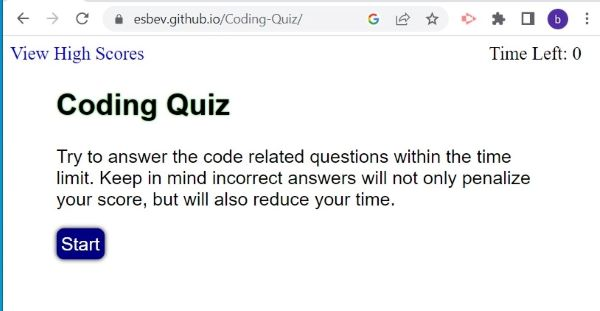
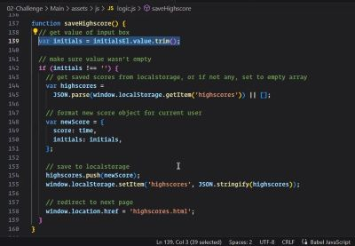
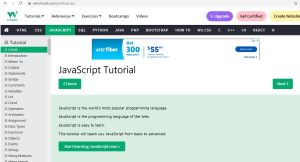
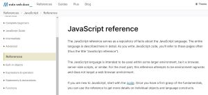

# Module 4 Challenge - Coding-Quiz

## Description

This website was built so a user can take a timed quiz, receive a score, store their score with their initials, and view and clear the score list. The user will click the start button for the quiz and be directed to a question with four possible answers choices. The user chooses an answer by simply clicking on the answer choice they deem to be correct. Correct and incorrect answers both automatically populate the next question with an indicator showing whether or not the answer was correct. Incorrect answers will remove time from the current amount of time left on the quiz timer. When the last question has been answered or the timer reaches zero the user is automatically directed to a new page displaying their score with a text box for them to enter their initials and save their score to a scorelist using the 'submit' button. Once the 'submit' button has been clicked the user is directed to the high scores page where they can clear the high scores list or return to the home page. 

## Table of Contents
- [Website Preview](#website-preview)
- [Credits](#credits)
    - [JavaScript Resources](#javascript-resources)
        - [Instructor Aided Code](#instructor-aided-code)
        - [Quiz Questions](#quiz-questions)
        - [W3schools.com](#w3schoolscom)
        - [Mozilla.org](#mozillaorg)
- [Special Thanks](#special-thanks)
- [License](#license)

## Website Preview

[Password Generator](https://esbev.github.io/Coding-Quiz/)

## Credits

NOTE: Click on a thumbnail to view source

- ### JavaScript Resources

    - #### Instructor Aided Code

        Instructor Eli Montoya provided a snippet of example code I followed very closely for a portion of this project

     - 

    - #### Quiz Questions

        Bootcamp student Joshua Stanford aided in providing the quiz questions I used for the project

    - #### W3schools.com

     - 

    - #### Mozilla.org

     - 

## Special Thanks

Thanks goes out to all the instructors and teacher assistants for their clear instruction and prompt and thorough answers to all my questions. Also, to all the students who joined in the study groups for their active participation and alternative perspectives. I was able to gain multiple insights I otherwise may not have gained towards the project without them. There is always strength in numbers.

## License

MIT License

Copyright (c) 2023 Eric

Permission is hereby granted, free of charge, to any person obtaining a copy
of this software and associated documentation files (the "Software"), to deal
in the Software without restriction, including without limitation the rights
to use, copy, modify, merge, publish, distribute, sublicense, and/or sell
copies of the Software, and to permit persons to whom the Software is
furnished to do so, subject to the following conditions:

The above copyright notice and this permission notice shall be included in all
copies or substantial portions of the Software.

THE SOFTWARE IS PROVIDED "AS IS", WITHOUT WARRANTY OF ANY KIND, EXPRESS OR
IMPLIED, INCLUDING BUT NOT LIMITED TO THE WARRANTIES OF MERCHANTABILITY,
FITNESS FOR A PARTICULAR PURPOSE AND NONINFRINGEMENT. IN NO EVENT SHALL THE
AUTHORS OR COPYRIGHT HOLDERS BE LIABLE FOR ANY CLAIM, DAMAGES OR OTHER
LIABILITY, WHETHER IN AN ACTION OF CONTRACT, TORT OR OTHERWISE, ARISING FROM,
OUT OF OR IN CONNECTION WITH THE SOFTWARE OR THE USE OR OTHER DEALINGS IN THE
SOFTWARE.